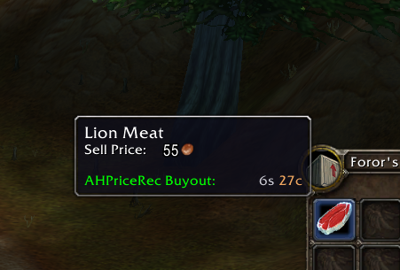
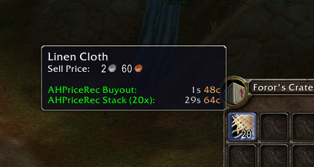

# AHBot Price Recommend

A World of Warcraft addon that shows a **safe Auction House buyout price** in item tooltips for servers running [mod-ah-bot](https://github.com/azerothcore/mod-ah-bot) (AzerothCore).

If you list an item at or below the recommended price, the AH bot's buyer will be willing to buy it.

> **Compatibility:** WoW **3.3.5a** (Wrath of the Lich King)

## Screenshots

Single item:



Stack of items (the stack total is shown when hovering a stack in your bags):



## How it works

The addon replicates the price check that mod-ah-bot's buyer uses:

```
maxBid = basePrice * (quality + 2)
```

- **basePrice**
  - `USE_BUY_PRICE = true`: the item's vendor `BuyPrice` from the bundled table (`AHBotPriceRecommend_BuyPrices.lua`). If the item is not in the table, `SellPrice * 4` is used as an estimate.
  - `USE_BUY_PRICE = false`: the item's vendor `SellPrice`.
- **quality**: the item's quality (0 = Poor, 1 = Common, 2 = Uncommon, ...).

The recommended price is **95% of `maxBid`**, leaving a small safety margin. For stacks, the value is multiplied by the stack count.

Tooltip lines:

| Line | Meaning |
| --- | --- |
| `AHPriceRec Buyout` | Recommended buyout for a single item |
| `AHPriceRec Stack (Nx)` | Recommended buyout for the whole stack |
| `AHPriceRec: Unknown (Price 0)` | The item has no vendor price, so no recommendation can be made |

## Installation

1. Download or clone this repository.
2. Copy the `AHBotPriceRecommend` folder into your client's `Interface/AddOns/` directory:
   ```
   World of Warcraft/Interface/AddOns/AHBotPriceRecommend/
   ```
3. Start the game and make sure **AHBot Price Recommend** is enabled in the AddOns list on the character select screen.

## Configuration

In game, open **Interface → AddOns → AHBot Price Recommend** and set the **Use vendor Buy Price** option to match your server's `mod-ah-bot.conf`:

| `mod-ah-bot.conf` | Addon setting |
| --- | --- |
| `AuctionHouseBot.UseBuyPriceForBuyer = 1` | Checked (default) |
| `AuctionHouseBot.UseBuyPriceForBuyer = 0` | Unchecked |

The change applies right away. It is saved per account in the `AHBotPriceRecommendDB` SavedVariable.

## License

[GNU GPL v3](LICENSE)
